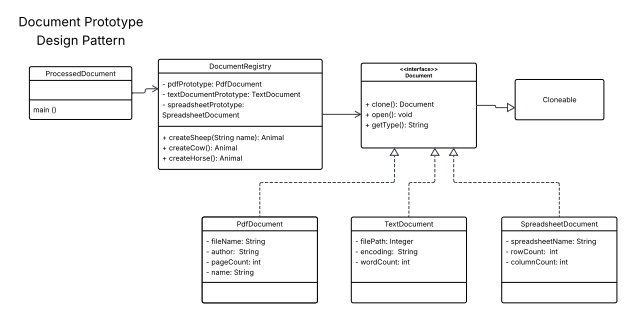

# Laboratory Assignment 7

This is Laboratory Assignment 7 for the course, Software Engineering 2, taken during the Second Semester of Academic Year 2025-2026 at New Era University.

## Problem Description

This activity implements the Prototype design pattern in Java to create copyable document objects from prototype instances. A `DocumentRegistry` stores default prototypes for `PdfDocument`, `TextDocument`, and `SpreadsheetDocument`, and clones them when new document instances are needed. This avoids constructing new objects from scratch and demonstrates how prototype copying can simplify object creation while preserving type-specific configuration.

## Class Description

- `Document` (interface)
  - Defines the prototype contract with `clone()`, `open()`, and `getType()` methods.

- `PdfDocument` (class)
  - Implements `Document` for PDF documents.
  - Stores `fileName`, `author`, and `pages`.
  - Provides `clone()` to create a copy and `open()` / `printDetails()` for output.

- `TextDocument` (class)
  - Implements `Document` for text documents.
  - Stores `filePath`, `encoding`, and `wordCount`.
  - Provides `clone()`, `open()`, and `printDetails()`.

- `SpreadsheetDocument` (class)
  - Implements `Document` for spreadsheet documents.
  - Stores `spreadsheetName`, `rowCount`, and `columnCount`.
  - Provides `clone()`, `open()`, and `printDetails()`.

- `DocumentRegistry` (class)
  - Holds prototype instances for each document type.
  - Creates new documents by cloning prototypes and setting their specific data.

- `ProcessedDocument` (class)
  - Contains the `main()` method.
  - Demonstrates creating and using cloned document objects from the registry.

## Expected Output

The program prints prototype creation messages, opens cloned documents, and prints their details. The expected console output is similar to:

```
Creating a PDF Document prototype.
Creating a Text Document prototype.
Creating a Spreadsheet Document prototype.

Opening PDF Document: annual_report_2024.pdf by Acme Corp (150 pages)
Type: PDF, File: annual_report_2024.pdf, Author: Acme Corp, Pages: 150

Opening Text Document: meeting_notes.txt with encoding: UTF-8 (250 words)
Type: Text, Path: meeting_notes.txt, Encoding: UTF-8, Words: 250

Opening Spreadsheet Document: sales_data_q1.xlsx (1000 rows, 20 columns)
Type: Spreadsheet, Name: sales_data_q1.xlsx, Rows: 1000, Columns: 20

Opening PDF Document: summary_report.pdf by Acme Corp (30 pages)
```

## Class Diagram

